---

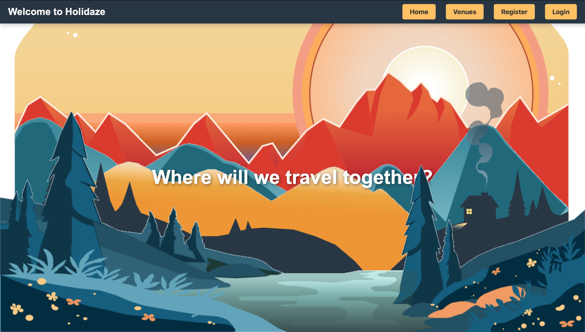
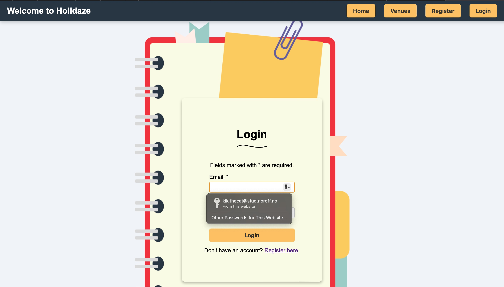
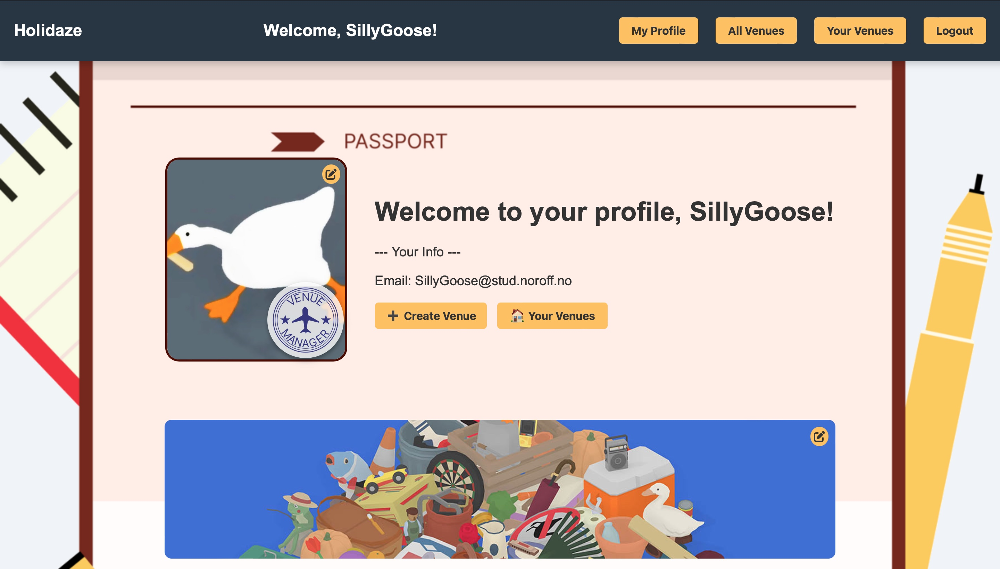
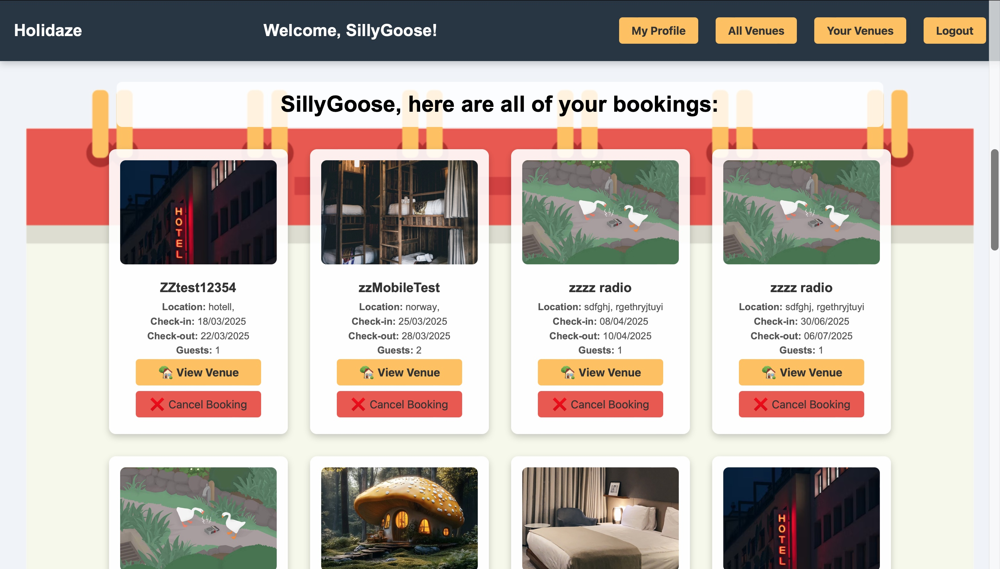

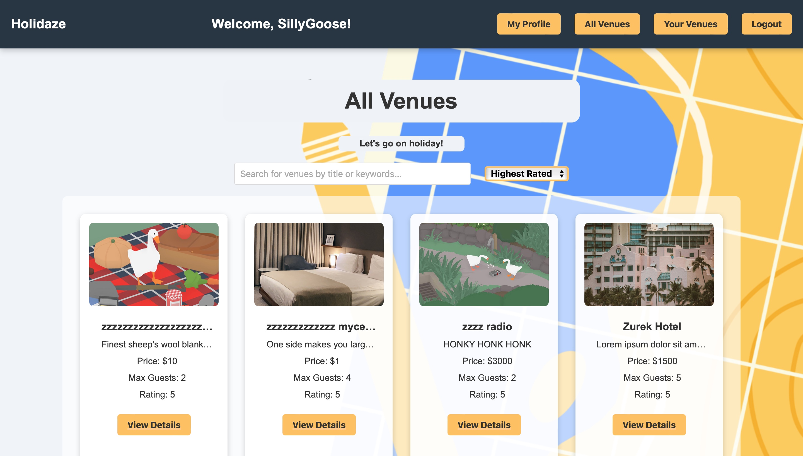
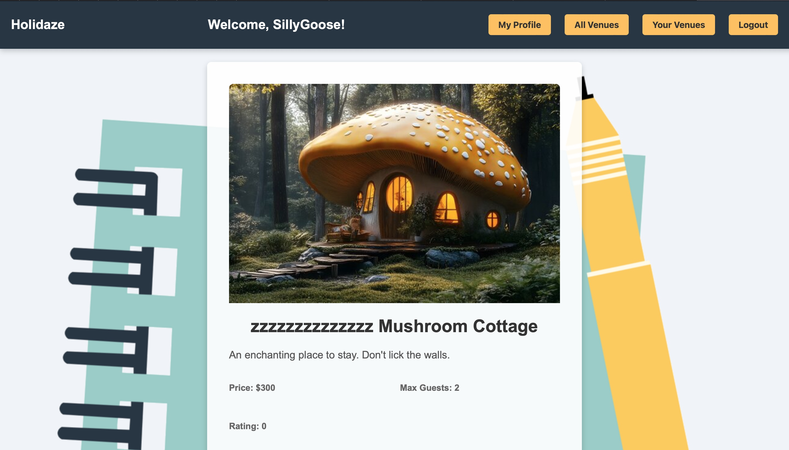
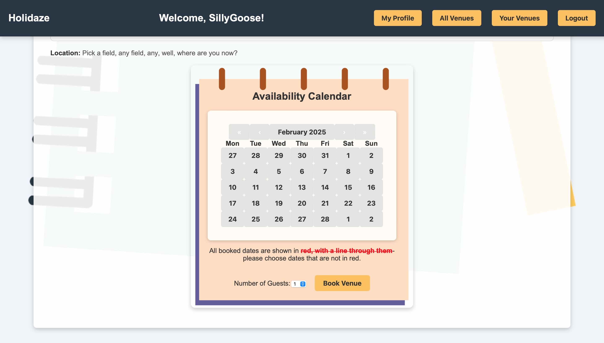

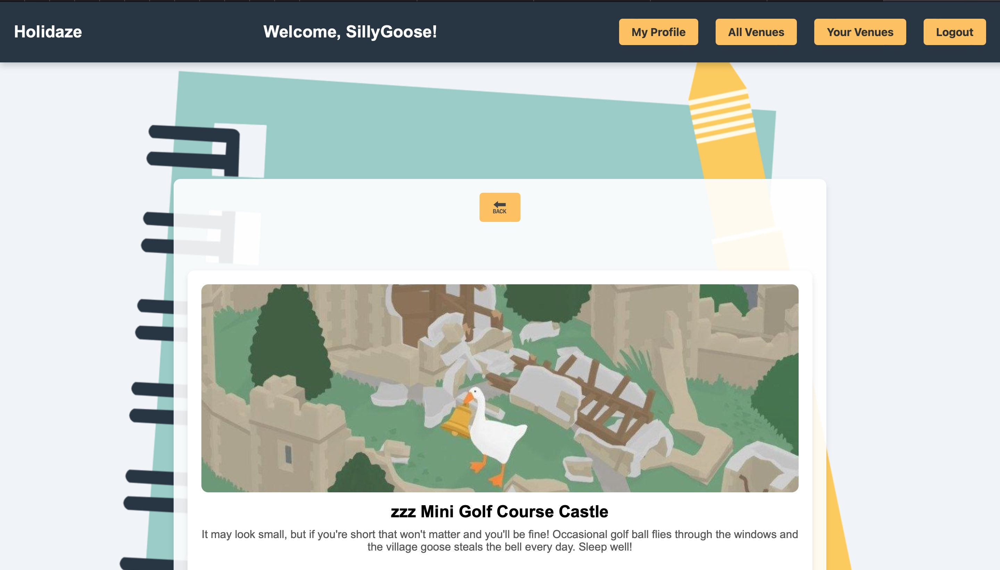
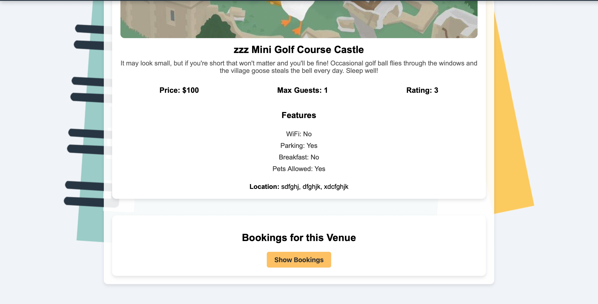

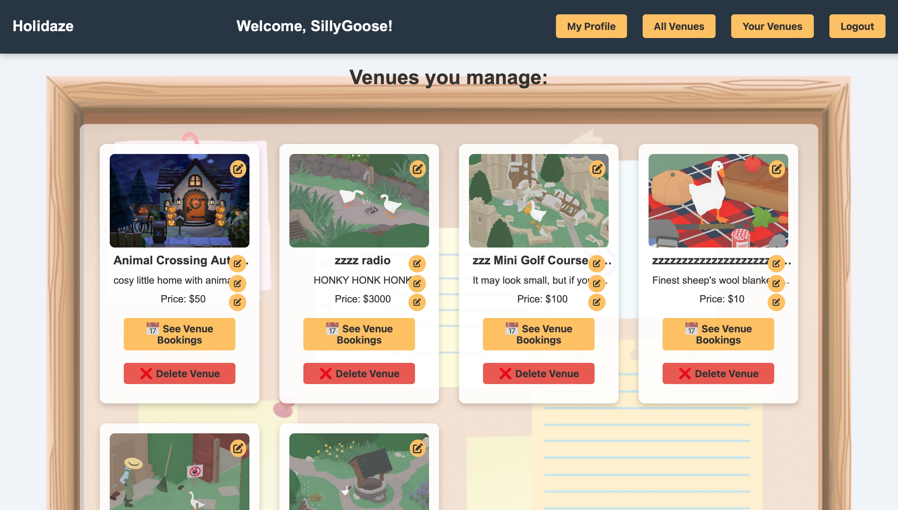

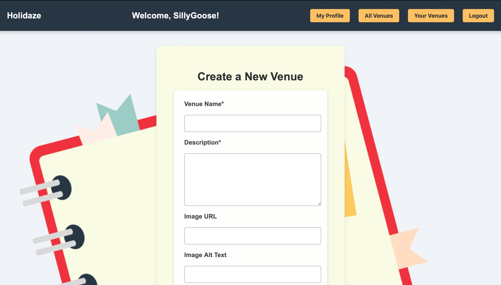

---

# project-exam-2-final-kitty-alice-case year 2
---

Our Final exam is.. finally here!

## Goal

To take the skills learned over the last two years and take on an extensive project where the finished product should reflect the candidate’s general development capabilities, in addition to visual and technical skills.

## Brief

A newly launched accommodation booking site called Holidaze has approached you to develop a brand new front end for their application. While they have a list of required features, the design and user experience has not been specified. Working with the official API documentation, plan, design and build a modern front end accommodation booking application.

There are two aspects to this brief: the customer-facing side of the website where users can book holidays at a venue, and an admin-facing side of the website where users can register and manage venues and bookings at those venues.

User Stories

The client has specified the following requirements in the form of User Stories:

* A user may view a list of Venues (Done).
* A user may search for a specific Venue (Done).
* A user may view a specific Venue page by id (Done).
* A user may view a calendar with available dates for a Venue (Done).
* A user with a stud.noroff.no email may register as a customer (Done).
* A registered customer may create a booking at a Venue (Done).
* A registered customer may view their upcoming bookings (Done).
* A user with a stud.noroff.no email may register as a Venue manager (Done).
* A registered Venue manager may create a Venue (Done).
* A registered Venue manager may update a Venue they manage (Done).
* A registered Venue manager may delete a Venue they manage (Done).
* A registered Venue manager may view bookings for a Venue they manage (Done).
* A registered user may login (Done).
* A registered user may update their avatar (Done).
* A registered user may logout (Done).
* Technical Restrictions (Done).

The company CTO has set the following technical restrictions:

Must use an approved JavaScript Framework -- React (>16)
Must use an approved CSS Framework  -- CSS Modules
Must be hosted on an approved Static Host -- Netlify
Must use an approved Design Application -- Figma
Must use an approved Planning Application -- Trello/ Figma

### Notes on project- reflections and things I would like to add in future.

I enjoyed that there were conditionals in my code- but think in future I would handle the two sides of the site differently, and separate themfurther, making the registration to become a venue manager a different registration altogether- 
I think this would further highlight the venue manager and registered user positions and make them more definied in their purpose.

## Future additions (Important, but not achieved due to time constraints).

* If no venues are available in your local storage, remove venue manager status and stamp.
  
* Ensure that a user cannot book two venues over the same dates- modal pop up that perhaps alerts of the other booking, gives the option of deleting the first or canceling the bokking the user is about to make- "You can't be in two places at once.. can you?".

* Style the bookings of the user (you) and the bookings of other users in different colours, so it can more easily be seen which holidays you booked.

* e2e testing on the registration and login pages.

* Make the card components modular - there was a lot of restyle issues because of initial shared styles that, though they worked well initially and i believed would give cleaner code, in the end there were small things i needed to differentiate so I separated them again- in future I would like to combine the styling and neaten it, use SOME shared styles, and add individuality to some others. For simplicity, i could remove a lot more styles if i made the card elements on my pages modular.

* Make search bar modular.

* Animate the clouds on the landing parallax.

* See all bookings on all venues, but only as a Venue Manager.

* Add additional edit buttons to Manage venue details page 

** Note **

## React was used for building this project

   

#### Getting Started

Installing

Clone the repo:

    git clone git@github.com:  https://github.com/AutopsyTurvy/e-commerce-store-front-end-frameworks.git
   
Double check for dependencies if need be- run this in your project root:

    cat package.json | grep dependencies

or simply open package.json and look under "dependencies".

`   Dependencies upon last push:
 "dependencies": {
    "@fortawesome/fontawesome-free": "^6.7.2",
    "date-fns": "^4.1.0",
    "react": "^18.3.1",
    "react-calendar": "^5.1.0",
    "react-dom": "^18.3.1",
    "react-icons": "^5.5.0",
    "react-router-dom": "^7.1.1",
    "sass": "^1.83.1"
  },
  "devDependencies": {
    "@eslint/js": "^9.17.0",
    "@types/react": "^18.3.18",
    "@types/react-dom": "^18.3.5",
    "@vitejs/plugin-react": "^4.3.4",
    "eslint": "^9.17.0",
    "eslint-plugin-react": "^7.37.2",
    "eslint-plugin-react-hooks": "^5.0.0",
    "eslint-plugin-react-refresh": "^0.4.16",
    "globals": "^15.14.0",
    "vite": "^6.0.5"
  } 
  `

Install the dependencies: N/A

    npm install

Running

To run the app, run the following commands:

    npm run build
    npm run dev

(You may also choose to add to/ clone this code in another way than through the command line or terminal, and you may do this by opening it in your chosen code editor, via GitHub desktop, and subsequently, VScode. )

## You will need to install and use React to contribute to this project 
---

Contributing

Contributions are welcome, but I would request that the invidicual that does so, clones the code and adds notes so that I can review any changes before they are comitted to the project permanently. Thank you! 

---

Contact:

Email me: 
kitty.letsbuzz@gmail.com

 

Find me on Discord:
(Kitty Alice Case
kittyalicerayworth)

---
---
---

# React App Automatic README Additions:

# Getting Started with Create React App

This project was bootstrapped with [Create React App](https://github.com/facebook/create-react-app).

## Available Scripts

In the project directory, you can run:

### `npm start`

Runs the app in the development mode.\
Open [http://localhost:3000](http://localhost:3000) to view it in your browser.

The page will reload when you make changes.\
You may also see any lint errors in the console.

### `npm test`

Launches the test runner in the interactive watch mode.\
See the section about [running tests](https://facebook.github.io/create-react-app/docs/running-tests) for more information.

### `npm run build`

Builds the app for production to the `build` folder.\
It correctly bundles React in production mode and optimizes the build for the best performance.

The build is minified and the filenames include the hashes.\
Your app is ready to be deployed!

See the section about [deployment](https://facebook.github.io/create-react-app/docs/deployment) for more information.

### `npm run eject`

**Note: this is a one-way operation. Once you `eject`, you can't go back!**

If you aren't satisfied with the build tool and configuration choices, you can `eject` at any time. This command will remove the single build dependency from your project.

Instead, it will copy all the configuration files and the transitive dependencies (webpack, Babel, ESLint, etc) right into your project so you have full control over them. All of the commands except `eject` will still work, but they will point to the copied scripts so you can tweak them. At this point you're on your own.

You don't have to ever use `eject`. The curated feature set is suitable for small and middle deployments, and you shouldn't feel obligated to use this feature. However we understand that this tool wouldn't be useful if you couldn't customize it when you are ready for it.

## Learn More

You can learn more in the [Create React App documentation](https://facebook.github.io/create-react-app/docs/getting-started).

To learn React, check out the [React documentation](https://reactjs.org/).

### Code Splitting

This section has moved here: [https://facebook.github.io/create-react-app/docs/code-splitting](https://facebook.github.io/create-react-app/docs/code-splitting)

### Analyzing the Bundle Size

This section has moved here: [https://facebook.github.io/create-react-app/docs/analyzing-the-bundle-size](https://facebook.github.io/create-react-app/docs/analyzing-the-bundle-size)

### Making a Progressive Web App

This section has moved here: [https://facebook.github.io/create-react-app/docs/making-a-progressive-web-app](https://facebook.github.io/create-react-app/docs/making-a-progressive-web-app)

### Advanced Configuration

This section has moved here: [https://facebook.github.io/create-react-app/docs/advanced-configuration](https://facebook.github.io/create-react-app/docs/advanced-configuration)

### Deployment

This section has moved here: [https://facebook.github.io/create-react-app/docs/deployment](https://facebook.github.io/create-react-app/docs/deployment)

### `npm run build` fails to minify

This section has moved here: [https://facebook.github.io/create-react-app/docs/troubleshooting#npm-run-build-fails-to-minify](https://facebook.github.io/create-react-app/docs/troubleshooting#npm-run-build-fails-to-minify)

# React + Vite

This template provides a minimal setup to get React working in Vite with HMR and some ESLint rules.

Currently, two official plugins are available:

- [@vitejs/plugin-react](https://github.com/vitejs/vite-plugin-react/blob/main/packages/plugin-react/README.md) uses [Babel](https://babeljs.io/) for Fast Refresh
- [@vitejs/plugin-react-swc](https://github.com/vitejs/vite-plugin-react-swc) uses [SWC](https://swc.rs/) for Fast Refresh
